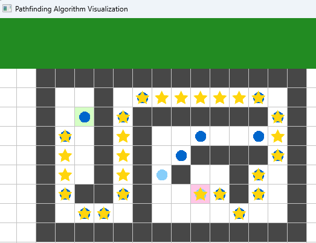
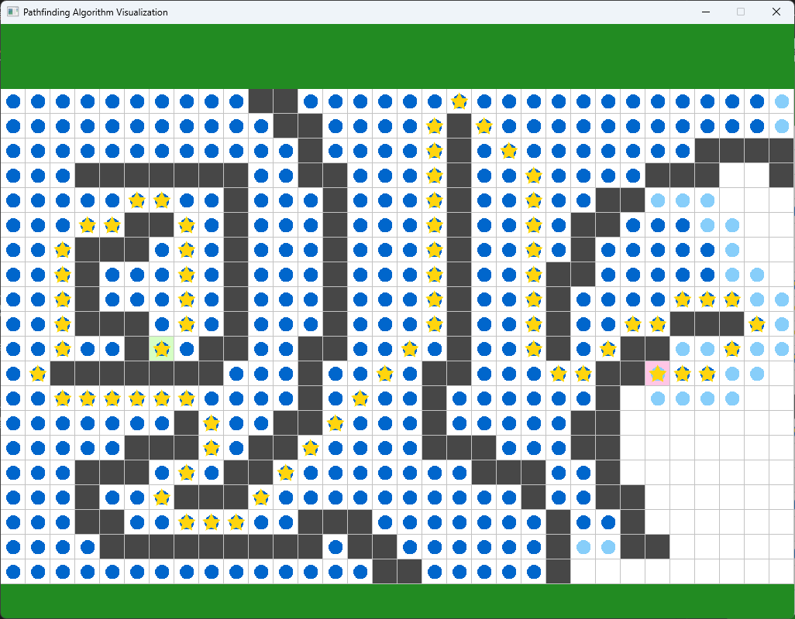
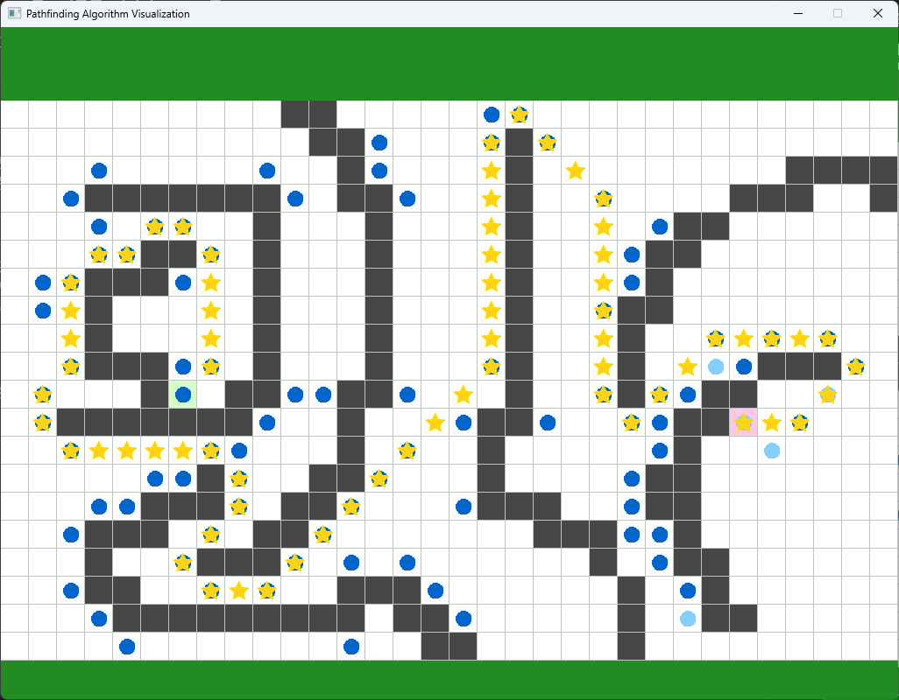

# Pathfinding Algorithm Visualizer (길찾기 알고리즘 시각화)

A* 알고리즘과 JPS 알고리즘을 시각적으로 확인할 수 있는 프로그램입니다.

## 아이콘 설명

- 🟩 초록색: 시작 지점
- 🟥 빨간색: 도착 지점
- ⭐ 노란 별: 최단 경로
- 🔵 진한 파란 원: 닫힌 노드(Closed Set)
- 🔵 연한 파란 원: 열린 노드(Open Set)

## 조작 방법
### 🗺️ 맵 편집

- 시작/도착 노드는 드래그로 이동
- 빈 칸 클릭 → 벽 생성
- 벽 클릭 → 벽 제거

### ⌨️ 단축키
| 단축키 | 기능 |
|--------|------|
| C | 모든 벽 제거 |
| A | A* 알고리즘 실행 |
| J | JPS 알고리즘 실행 |

## 코드
<Game Programming in C++> 도서의 4장 예제 코드 기반에 시각화기능 및 길찾기 알고리즘 추가.

길찾기 알고리즘은 `PathFindingAlgorithm.cpp` 에서 확인 가능.

## A* 알고리즘
A* 알고리즘은 휴리스틱값과 경로 비용 값을 활용하여 최단거리 검색을 보장하는 알고리즘.

맵이 커질 경우 탐색량이 커짐.

자세한 내용: [A* 알고리즘 설명(개인 블로그)](https://dev-sbee.tistory.com/17)

## JPS 알고리즘
대칭 경로에 대한 불필요한 탐색을 줄여 넓은 맵에서 A* 대비 성능을 향상시킨 알고리즘.

격자형식의 맵에서만 사용 가능.

자세한 내용: [zerowidth positive lookahead](https://zerowidth.com/2013/a-visual-explanation-of-jump-point-search/)

